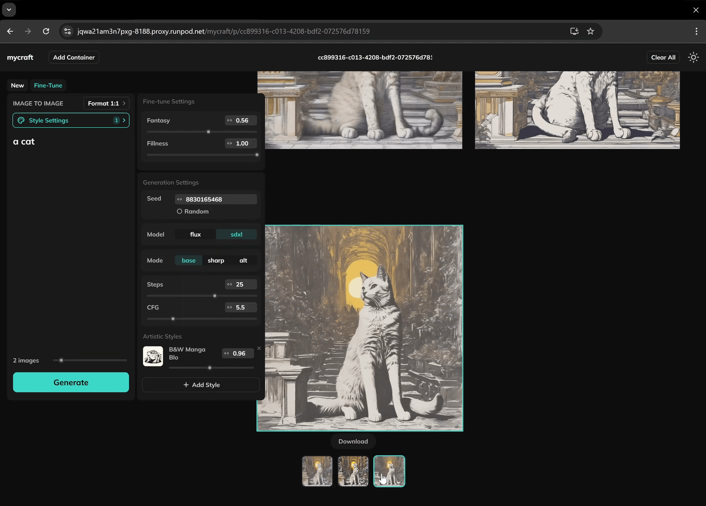
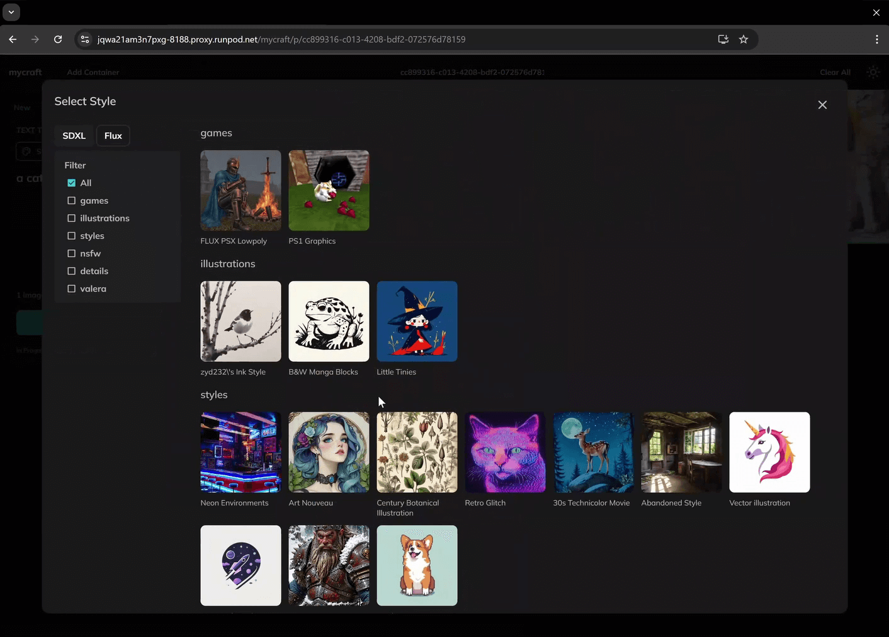

# Mycraft (Alpha Experimental Version)

### Mycraft provides a limitless storyboard experience for image generation, powered by the ComfyUI API.

- Each container functions as an independent ComfyUI workflow.
- Supports workflows (text-to-text) and fine-tuning (image-to-image).
- Supports [workflow customization](./CUSTOM_WORKFLOWS.md).

## Get Started

## 1. Installation

1. Install [ComfyUI](https://github.com/comfyanonymous/ComfyUI).

2. Clone this repository into the `custom_nodes` directory:

   ```bash
   cd ComfyUI/custom_nodes
   git clone https://github.com/uauaouau/mycraft-comfyui.git
   ```

3. Start ComfyUI.

4. Go to http://localhost:8188/mycraft.

## 2. Install ComfyUI Dependencies

This project uses the following dependencies to enhance the user experience:

- [rgthree-comfy](https://github.com/rgthree/rgthree-comfy.git)
- [Impact Pack](https://github.com/ltdrdata/ComfyUI-Impact-Pack)
- [ComfyUI-load-image-from-url](https://github.com/tsogzark/ComfyUI-load-image-from-url)

### Installation Options:

- **Via ComfyUI Manager**: Automatically installs dependencies and unzips the `mycraft.zip` file using the provided install script.
- **Manual Installation**: Clone the repositories into the `ComfyUI/custom_nodes` directory:

  ```bash
  git clone https://github.com/rgthree/rgthree-comfy.git
  git clone https://github.com/ltdrdata/ComfyUI-Impact-Pack.git
  git clone https://github.com/tsogzark/ComfyUI-load-image-from-url.git
  ```

Then, unzip `mycraft.zip` into `/ComfyUI/custom_nodes/mycraft-comfyui`.

```
cd /ComfyUI/custom_nodes/mycraft-comfyui
python install.py
```

After installation, the directory structure should look like this:

```
mycraft-comfyui
├── ...
├── mycraft
│   ├── build
│   ├── ...
├── __init__.py
├── mycraft.zip
├── ...
```

## Workflows

This project currently supports **text-to-text** and **image-to-image** workflows using the **KSampler** sampler for models:

- **SDXL**: `workflows/sdxl.json`
- **Flux 1 Dev**: `workflows/flux.json`

### Custom Workflows

You can use your own workflows, but certain nodes with specific constant IDs must be included. Refer to [this list of required nodes](./CUSTOM_WORKFLOWS.md).

### [Learn More About Workflows](./CUSTOM_WORKFLOWS.md)

# Lora Styles List



### ⚠️ It is recommended to organize your LoRA files in a parent directory named after the model class.

For example, instead of placing a file at `.../ComfyUI/models/loras/hello.safetensor`, consider using a structure like `.../ComfyUI/models/loras/sdxl/<filter-name>/hello.safetensor`. While the directory name as a filter name is not mandatory, it is highly beneficial when using filters in the browser UI.

## Titles and Thumbnails

Organize your Lora styles beautifully by creating a `.json` configuration file named after the corresponding `.safetensor` model.

### Example Configuration File (`BW-000014.json`):

```json
{
  "id": "BW-000014.safetensors",
  "title": "B&W Manga Blocks",
  "file_url": "https://civitai.com/api/download/models/564339?type=Model&format=SafeTensor",
  "url": "https://civitai.com/models/507750/bandw-manga-blocks",
  "author": "alvdansen",
  "trigger": "black and white masterpiece illustration",
  "default": 1,
  "preview": [
    "https://image.civitai.com/xG1nkqKTMzGDvpLrqFT7WA/9f9e3101-a4d7-472f-b18e-cd71ecc99fce/anim=false,width=450/BW_e000014_01_20240610214155.jpeg"
  ]
}
```

Place the `.json` file in the same directory as the `.safetensor` model file.

---

## Hotkeys

- `[Select container]` + `Ctrl + D`: Duplicate container
- `[Select container]` + `Alt` + Drag `Mouse`: Duplicate container
- `[Select container]` + `Ctrl + X` or `Delete`: Delete container
- `Mouse Scroll`: Zoom

## Roadmap

This is the minimal viable product version of Mycraft. Currently, it includes basic functionality, but many innovations are planned for future updates. These will enable modular and abstract customization, allowing the UI to be tailored to specific tasks.
