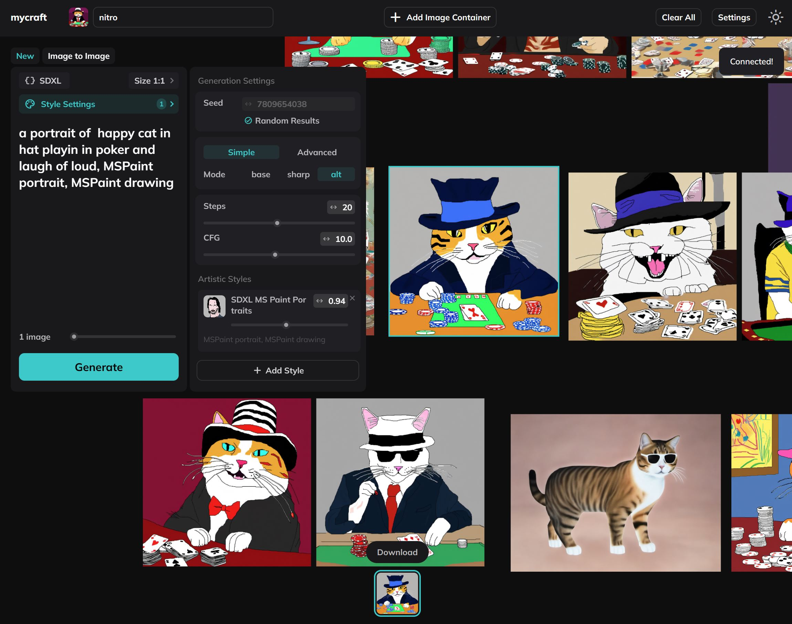
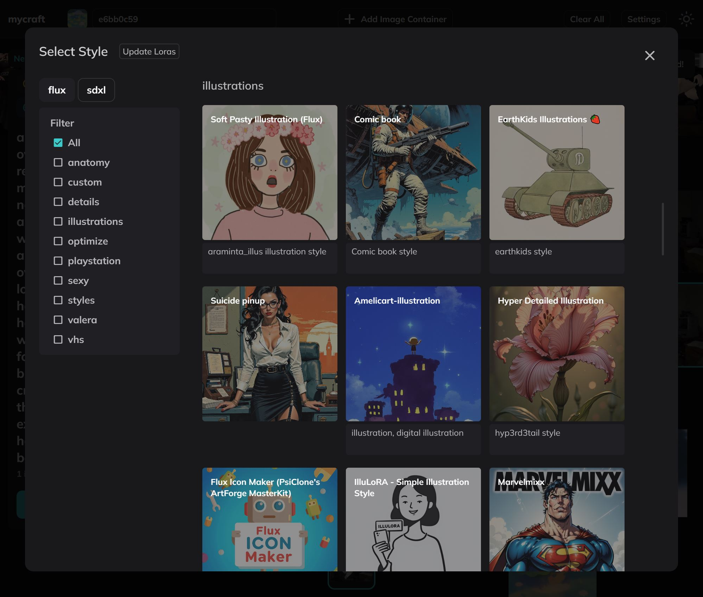
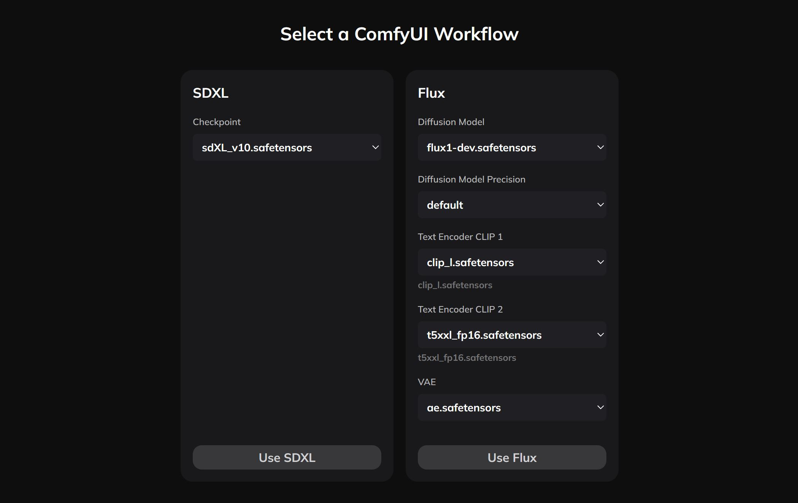

# Mycraft (Alpha Experimental Version)

### Mycraft provides a storyboard experience for image generation, powered by the ComfyUI API.

- Each container functions as an independent ComfyUI workflow.
- Supports workflows (text-to-text) and fine-tuning (image-to-image).
- Supports [workflow customization](./CUSTOM_WORKFLOWS.md).
- **SDXL** and **Flux 1 Dev** workflows supported by default.

## Get Started

## 1. Installation

1. Install [ComfyUI](https://github.com/comfyanonymous/ComfyUI).

2. Clone this repository into the `custom_nodes` directory:

   ```bash
   cd ComfyUI/custom_nodes
   git clone https://github.com/uauaouau/mycraft-comfyui.git
   ```

3. Install ComfyUI Dependencies (custom nodes):
    ```bash
    git clone https://github.com/rgthree/rgthree-comfy.git
    git clone https://github.com/tsogzark/ComfyUI-load-image-from-url.git
    git clone git clone https://github.com/JPS-GER/ComfyUI_JPS-Nodes.git
    ```

3. Start ComfyUI.

4. Go to http://localhost:8188/mycraft.


## Run Mycraft UI

Since you have installed Mycraft UI as ComfyUI Custom Node you can open your ComfyUI instance and add `/mycraft` to address like:

```
http://localhost:8188/mycraft
```

or
```
http://0.0.0.0:8188/mycraft
```

It works offline also.

# Beautiful Lora Styles Catalog



### ⚠️ It is recommended to organize your LoRA files in a parent directory named after the model class.

For example, instead of placing a file at `.../ComfyUI/models/loras/hello.safetensor`, consider using a structure like `.../ComfyUI/models/loras/sdxl/<filter-name>/hello.safetensor`. While the directory name as a filter name is not mandatory, it is highly beneficial when using filters in the browser UI.

## Civitai Lora Metadata

By default Mycraft uses Civitai API to get your LORA files metadata automatically when first start:

1. It gets checksum sha256 of all `.safetensor` files in `.../ComfyUI/models/loras` directory.
2. Find model metadata by checksums with Civitai API.
3. Generates `lorashashes.json` cache file in `.../ComfyUI/custom_nodes/mycraft-comfyui/` directory.

To repeat this process manually you can press **Update Loras** button in **Select Styles** overlay.


## Manual Lora Metadata (Experimental Beta)

### Titles and Thumbnails

Organize your Lora styles beautifully by creating a `.json` configuration file named after the corresponding `.safetensor` model.

### Example Configuration File (`BW-000014.json`):

```json
{
  "id": "BW-000014.safetensors",
  "title": "B&W Manga Blocks",
  "file_url": "https://civitai.com/api/download/models/564339?type=Model&format=SafeTensor",
  "url": "https://civitai.com/models/507750/bandw-manga-blocks",
  "author": "alvdansen",
  "trigger": "black and white masterpiece illustration",
  "default": 1,
  "preview": [
    "https://image.civitai.com/xG1nkqKTMzGDvpLrqFT7WA/9f9e3101-a4d7-472f-b18e-cd71ecc99fce/anim=false,width=450/BW_e000014_01_20240610214155.jpeg"
  ]
}
```

Place the `.json` file in the same directory as the `.safetensor` model file.


## Workflows



This project currently supports **text-to-text** and **image-to-image** workflows using the **KSampler** sampler for models:

- **SDXL**: `workflows/sdxl.json`
- **Flux 1 Dev**: `workflows/flux.json`

### Settings for Flux 1 Dev Workflow

Please check the `workflows/flux.json` file and change `weight_dtype` value based on your needs:

```json
  "12": {
    "inputs": {
      "unet_name": "flux1-dev.safetensors",
      "weight_dtype": "fp8_e4m3fn" // here
    },
    "class_type": "UNETLoader",
    "_meta": {
      "title": "Load Diffusion Model"
    }
  },
```

So as the CLIPs:

```json
  "13": {
    "inputs": {
      "clip_name1": "t5xxl_fp16.safetensors", // here
      "clip_name2": "clip_l.safetensors", // here
      "type": "flux",
      "device": "default"
    },
    "class_type": "DualCLIPLoader",
    "_meta": {
      "title": "DualCLIPLoader"
    }
  },
```


### Custom Workflows

You can use your own workflows, but certain nodes with specific constant IDs must be included. Refer to [this list of required nodes](./CUSTOM_WORKFLOWS.md).

### [Learn More About Workflows](./CUSTOM_WORKFLOWS.md)

## Hotkeys

- `[Select container]` + `Ctrl + D`: Duplicate container
- `[Select container]` + `Alt` + Drag `Mouse`: Duplicate container
- `[Select container]` + `Ctrl + X` or `Delete`: Delete container
- `Mouse Scroll`: Zoom

## Roadmap

This is the minimal viable product version of Mycraft. Currently, it includes basic functionality, but many innovations are planned for future updates. These will enable modular and abstract customization, allowing the UI to be tailored to specific tasks.

## Third-Party Modules

This project uses the following dependencies to enhance the user experience:

- [rgthree-comfy](https://github.com/rgthree/rgthree-comfy.git)
- [ComfyUI_JPS-Nodes](https://github.com/JPS-GER/ComfyUI_JPS-Nodes)
- [ComfyUI-load-image-from-url](https://github.com/tsogzark/ComfyUI-load-image-from-url)

