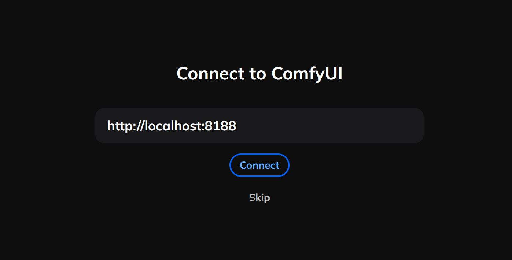
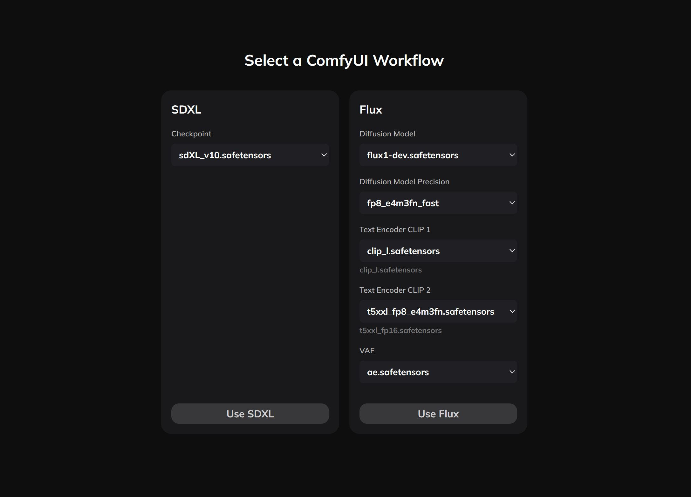

# Mycraft UI (standalone)

This article relates to the standalone version of Mycraft UI available at https://mycraft.zashifrovano.com/mycraft as simple frontend user interface for your ComfyUI instance.

### Mycraft provides a limitless storyboard experience for image generation, powered by the ComfyUI API.

- Each container functions as an independent ComfyUI workflow.
- Supports workflows (text-to-text) and fine-tuning (image-to-image).
- Supports [workflow customization](./CUSTOM_WORKFLOWS.md).


## 1. Install required Custom Nodes 

The Mycraft UI uses the following custom nodes to enhance the user experience:

- [rgthree-comfy](https://github.com/rgthree/rgthree-comfy.git) (for the [Power Lora Loader](https://github.com/rgthree/rgthree-comfy?tab=readme-ov-file#power-lora-loader)).
- [Impact Pack](https://github.com/ltdrdata/ComfyUI-Impact-Pack) (for the [Switch Latent legacy](https://github.com/ltdrdata/ComfyUI-Impact-Pack?tab=readme-ov-file#switch-nodes) and [Concat Conditionings](https://github.com/ltdrdata/ComfyUI-Impact-Pack?tab=readme-ov-file#etc-nodes)).
- [ComfyUI-load-image-from-url](https://github.com/tsogzark/ComfyUI-load-image-from-url) (is using for img2img).


Installation:

```sh
cd <your-path-to>/ComfyUI/custom_nodes

git clone https://github.com/rgthree/rgthree-comfy.git
cd rgthree-comfy && pip install -r requirements.txt

cd ..

git clone https://github.com/ltdrdata/ComfyUI-Impact-Pack.git
cd ComfyUI-Impact-Pack && pip install -r requirements.txt

cd ..

git clone https://github.com/tsogzark/ComfyUI-load-image-from-url.git
```

## 2. Run the ComfyUI instance with preview method and allowed CORS for Mycraft UI

Please set the additional parameters to run your ComfyUI instance:

1. `--preview-method auto` - it allows to see the generation process preview in a realtime.
2. `--enable-cors-header https://mycraft.zashifrovano.com` - it allows to Mycraft UI communicate with your ComfyUI.

```sh
python main.py --preview-method auto --enable-cors-header https://mycraft.zashifrovano.com
```


## 4. Connect your ComfyUI instance with Mycraft UI

1. Go to ... and paste your ComfyUI instance address. By default it is the `https://localhost:8188`.



2. Select the predefined workflow based on model.



3. After default workflow was defined in the step 2, now you can use Mycraft UI with your ComfyUI instance! 🎉🎆

4. Please keep in mind so this is not a production-ready product. 
